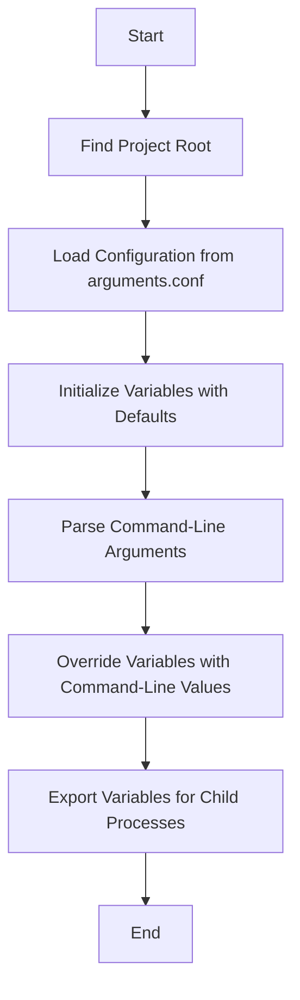

# Variable Loader Script Documentation

## Table of Contents

1. [Purpose](#purpose)
2. [Usage](#usage)
3. [Configuration Loading](#configuration-loading)
4. [Variable Management](#variable-management)
5. [Command-Line Argument Parsing](#command-line-argument-parsing)
6. [Example Usage](#example-usage)

## Purpose

The `variable_loader.sh` script is designed to load and manage configuration variables for the project. It provides a flexible way to configure the project using a combination of default values and command-line overrides.

## Usage

To use `variable_loader.sh`, simply source it in your bash script. The script accepts various command-line options to override default variable values. Use `--help` to display usage information.

## Configuration Loading

The script loads configuration from the `arguments.conf` file located in the project root. The project root is determined by searching for this file starting from the script's directory and moving upwards.

## Variable Management

Variables are initialized with default values from `arguments.conf`. The script supports overriding these defaults using command-line arguments. It also handles specific variables like `UFW_PORTS` as arrays.

## Command-Line Argument Parsing

The script parses command-line arguments to override default variable values. It supports long options. Unknown options result in an error.

## Example Usage

Here's an example of how to use `variable_loader.sh` in another script:

```bash
#!/usr/bin/env bash
set -euo pipefail

# Load and initialize all variables + parse overrides
source "$(dirname "${BASH_SOURCE[0]}")/config/variable_loader.sh" "$@"
source "$(dirname "${BASH_SOURCE[0]}")/../config/variable_loader.sh" "$@" # if script is in a folder and have to go one dir up

# Use the variables
echo "SSH will run on port: $SSH_PORT"
echo "UFW will allow ports: $UFW_PORTS"
echo "Lock file: $LOCKFILE"

# If needed, split UFW_PORTS into an array
read -r -a ports_array <<< "$UFW_PORTS"
for port in "${ports_array[@]}"; do
  echo "Allowing port: $port"
done
```

### Workflow Diagram


